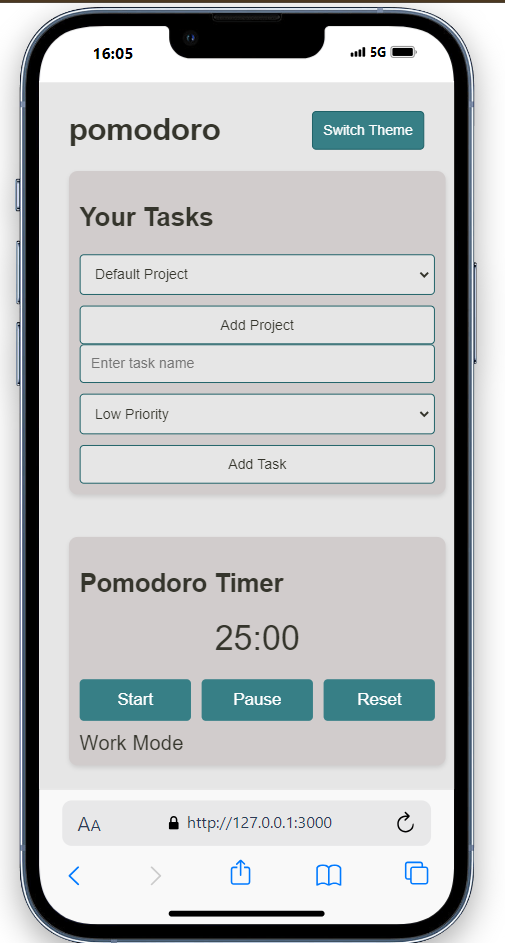

# Task Manager with Pomodoro Timer



## Overview
The **pomodoror** is a productivity tool that helps you manage your tasks efficiently while incorporating the Pomodoro technique. The app allows you to create and prioritize tasks, track your progress, and analyze your productivity with detailed analytics.

## Features

- **Task Management**: Add, edit, delete, and prioritize tasks.
- **Pomodoro Timer**: Integrated timer that helps you focus with work/break intervals.
- **Session Tracking**: Keeps track of your work and break sessions.
- **Analytics Dashboard**: Visualize your time spent on tasks, track your average session length, and monitor task completion rates.
- **Responsive Design**: Optimized for both desktop and mobile devices.
- **Theme Switching**: Toggle between light and dark themes for a personalized experience.
- **Export Data**: Export session data as a CSV file for further analysis.

## Technologies Used

- **HTML/CSS**: For structure and styling.
- **JavaScript**: To manage tasks, timer functionality, and analytics.
- **Chart.js**: For creating interactive charts in the analytics dashboard.
- **Local Storage**: To persist tasks and settings between sessions.

## Installation

1. Clone the repository:
   ```bash
   git clone https://github.com/keremsemiz/pomodoro.git
   cd pomodoro
